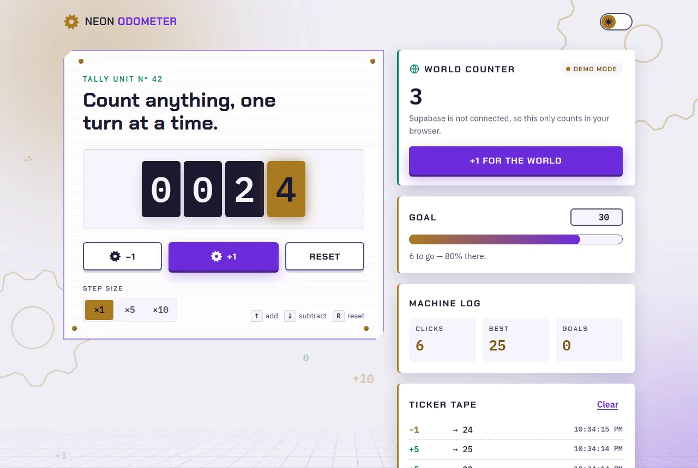
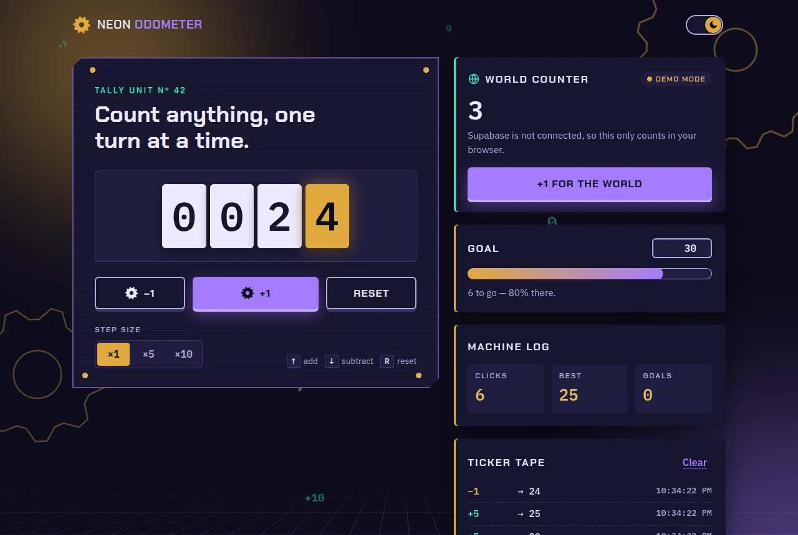
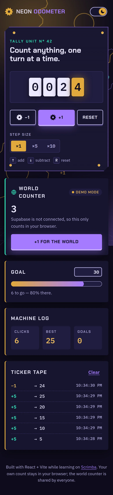

# Neon Odometer · Scrimba React Counter

A glowing mechanical click counter built with React and Vite. Digits roll into place on odometer wheels while gears turn in the background.

**[▶ Live demo](https://brutall100.github.io/scrimba-react-counter/)** · **[Source code](https://github.com/brutall100/scrimba-react-counter)**



<p>
  
  
</p>

## About

This started as the default "count is 0" button from the Vite + React template, made while I was working through the [Scrimba](https://scrimba.com) React course. I turned it into a small, complete app: a retro-futuristic tally machine that mixes a brass odometer with neon arcade lights.

## Features

- **Rolling odometer**: each digit is a wheel that spins to the new number. Negative numbers get a sign.
- **Step sizes**: count by ×1, ×5 or ×10.
- **Goal meter**: set a target, watch the progress tube fill up, and get a burst of sparks when you reach it.
- **Machine log**: total clicks, best score and goals reached, with numbers that count up.
- **Ticker tape**: the last 8 moves, with times.
- **Keyboard controls**: `↑` / `+` add, `↓` / `−` subtract, `R` resets.
- **Remembers everything**: count, settings and history are saved in `localStorage`.
- **Live background**: turning gears, drifting brass and violet glows, a neon grid floor and rising digits, all created at random in JavaScript. Only `transform` and `opacity` are animated. Phones get half the particles.
- **Light and dark themes**: follows your system, has a toggle that remembers your choice, and never flashes the wrong theme on load.
- **Accessible**: skip link, visible focus rings, labelled inputs, screen reader announcements, and WCAG AA contrast. `prefers-reduced-motion` turns off all movement.
- **Responsive**: works down to 390px wide with no sideways scrolling.

## Built with

- [React 18](https://react.dev): `useReducer`, `useEffect`, `useRef` and custom hooks
- [Vite 5](https://vitejs.dev): dev server and build
- Plain CSS with custom properties. The whole palette lives in [`src/styles/tokens.css`](src/styles/tokens.css).
- GitHub Actions: builds the site and deploys it to GitHub Pages

### Colour palette

| Role | Light | Dark |
| --- | --- | --- |
| Background | `#EEEDF5` | `#0E0C1C` |
| Surface | `#FFFFFF` | `#181530` |
| Text | `#1B1830` | `#ECE9FF` |
| Brass accent | `#A97A22` (text: `#7A5410`) | `#E0A93B` |
| Neon violet | `#6C2BD9` | `#A57BFF` |
| Neon mint | `#007A63` | `#2EF2C0` |

Every text and background pair I use passes WCAG AA: at least 4.5:1 for text and at least 3:1 for UI parts.

### Fonts

Self-hosted with [Fontsource](https://fontsource.org), all from Google Fonts:

- **Chakra Petch** for headings and buttons
- **IBM Plex Sans** for body text
- **IBM Plex Mono** for the odometer digits and numbers

## What I learned

- How to keep related state in one place with `useReducer`, and how to save it with a small custom hook.
- How to build a rolling odometer with nothing but a CSS `transform` on a strip of digits.
- How to animate a background smoothly: stick to `transform` and `opacity`, use `position: fixed` and `pointer-events: none`, and respect `prefers-reduced-motion`.
- How to set up a design with CSS variables, so a light and dark theme are just two sets of values.
- How to stop the theme flashing on load by setting it in a tiny script before React starts.
- How to deploy a Vite app to GitHub Pages with a `base` path and a GitHub Actions workflow.

## Run it locally

You need [Node.js](https://nodejs.org) 18 or newer.

```bash
git clone https://github.com/brutall100/scrimba-react-counter.git
cd scrimba-react-counter
npm install
npm run dev
```

Then open the address Vite prints (usually `http://localhost:5173/scrimba-react-counter/`).

Other scripts:

```bash
npm run build    # production build in dist/
npm run preview  # serve the production build
npm run lint     # check the code with ESLint
```

No environment variables or server are needed. Everything runs in the browser.

## Project structure

```
.
├── .github/workflows/deploy.yml   # build and deploy to GitHub Pages
├── docs/                          # README screenshots
├── public/
│   ├── favicon.svg
│   └── theme-init.js              # picks the theme before the page paints
├── src/
│   ├── components/                # odometer, live background, goal meter, ...
│   ├── hooks/                     # persisted reducer, count-up, reveal, reduced motion
│   ├── lib/                       # counter reducer and gear shape maths
│   ├── styles/
│   │   ├── tokens.css             # colours, fonts and sizes
│   │   └── app.css                # layout and components
│   ├── app.jsx
│   └── main.jsx
├── index.html
├── package.json
└── vite.config.js
```

## Credits

- Made while following the React course on [Scrimba](https://scrimba.com).
- Started from the official [Vite](https://github.com/vitejs/vite) React template (MIT, © 2019-present VoidZero Inc. and Vite contributors).
- Fonts: Chakra Petch, IBM Plex Sans and IBM Plex Mono, all under the SIL Open Font License, served with Fontsource.

## License

[MIT](LICENSE) © 2026 brutall100
